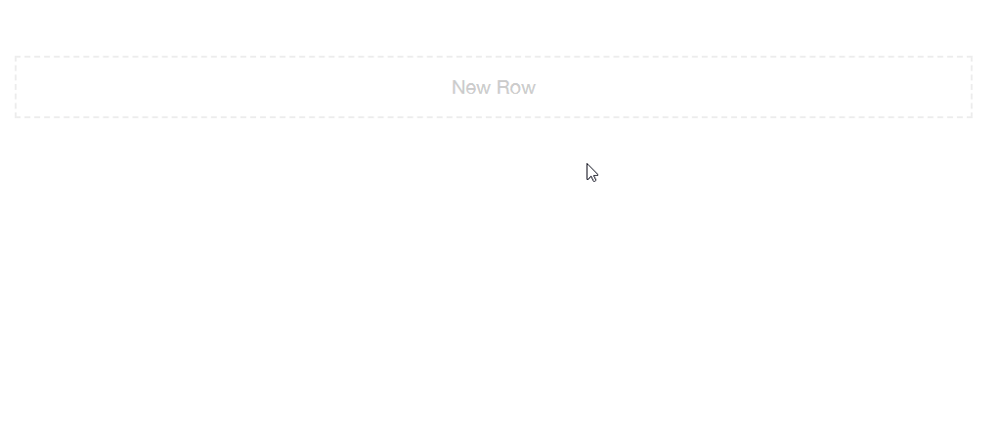

<div align="center">
  <h1>NHS Service Page Builder</h1>
  <p>NHS Service Page Builder is a frontend tool to quickly create HTML page.</p>
</div>

<h2 align="center">Prerequisites</h2>

This project relies on

1. NodeJs >= 8.8.1. Download: https://nodejs.org/en/download/
2. php executable >= 7.4. Download: https://www.php.net/downloads.php

<h2 align="center">Install</h2>

Install with shell script:

Clone the repository, and run
```bash
./install.sh
```

Install manually:

Clone the repository, and run `npm install` in both backend and frontend folder.
```bash
cd backend/
npm install
cd ../frontend/
npm install
```

<h2 align="center">Get Started</h2>

```bash
./start.sh
```

Close the terminal can stop serving and release

<h2 align="center">Concepts</h2>

The builder has 3 types of elements: Row, Column and Block. The builder is what you see is what you get.




<h2 align="center">Export the page and deploy</h2>

Once finished building, use Export button to get the full HTML.

When deploying the exported page to a server, the external static assets must be hosted on the server.

In `backend/lib/generator.class.php`, replace `http://localhost:3000/` with the target server address, for example, `http://example.com`.

Make sure the external linked static assets are available on the target server. For example, the folder available at `http://localhost:3000/css/fonts` must upload to `http://example.com/css/fonts`.

Then, restart the project and import/export again.

<h2 align="center">Contributors</h2>

KD Web is a full service web design agency based in London. We craft beautiful, engaging websites and deliver successful SEO campaigns.

Developer: Ruichao Wang

Designer: Simeon Artamonov
